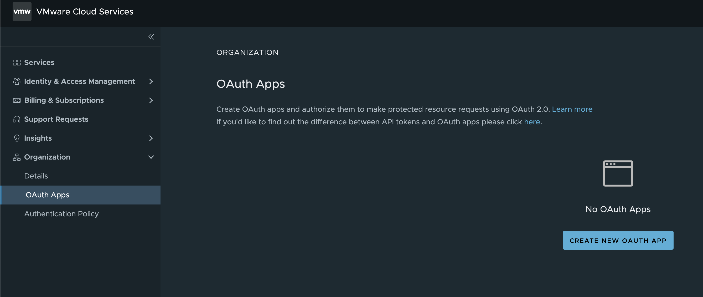
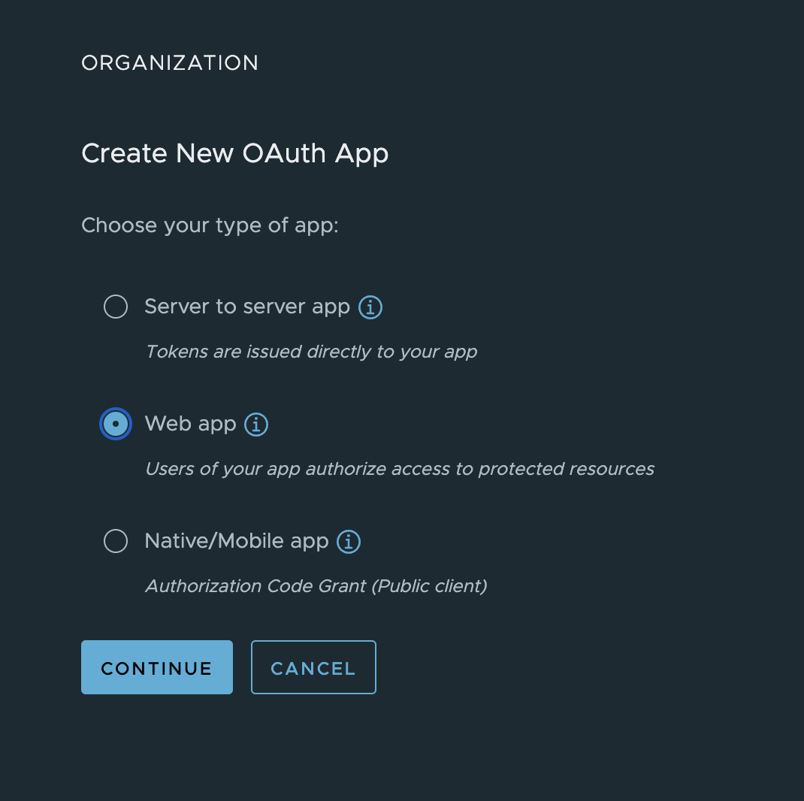
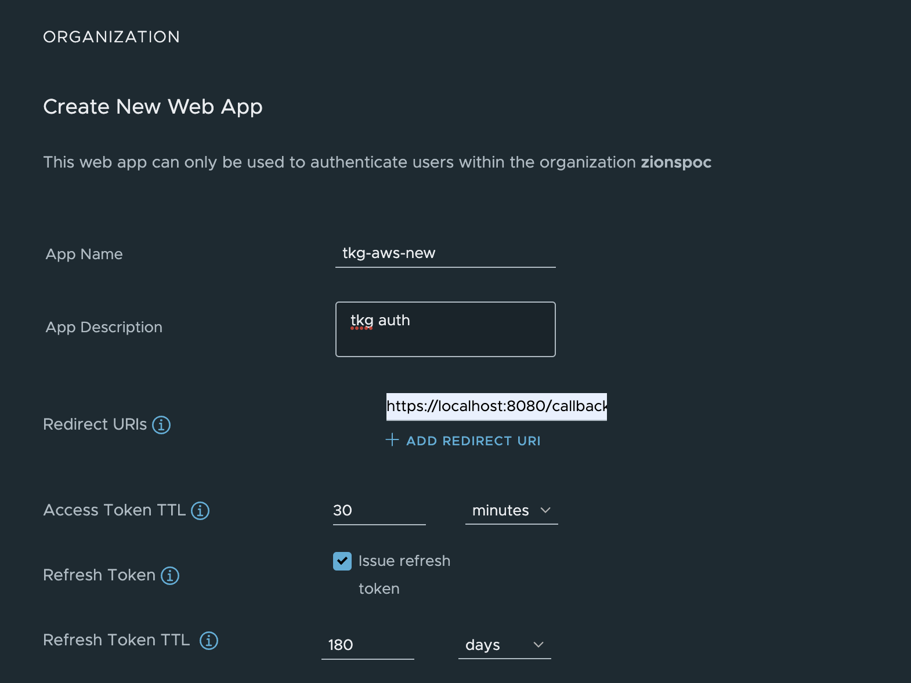
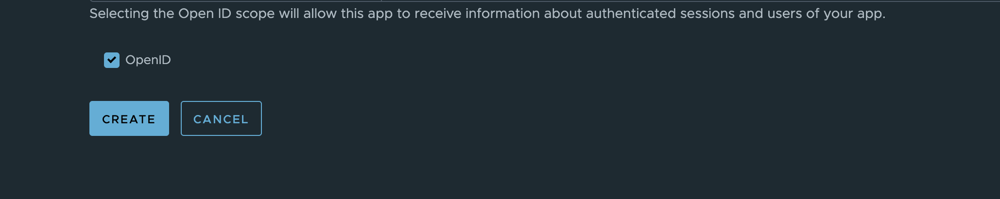
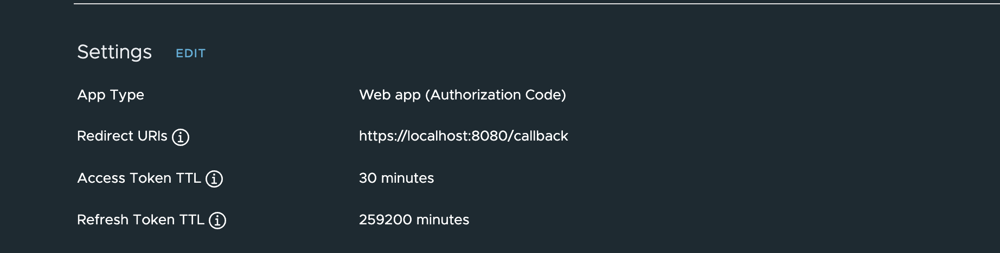

# CSP OIDC Authentication for TKG Clusters

This will outline the process for setting up authentication on the TKG management cluster using OIDC and VMware Cloud as the provider. Authentication in TKG is handled by Pinniped behind the scenes.

## Prerequisites

* VMware Cloud organization and permission to create an OAuth app.
* TKG management cluster (existing or new) 


## Set your default VMware Cloud organization

This is only required temporarily, the version of Pinniped packaged with TKG (1.5.3 as of this post) does not yet support the required flag to set the organization ID from pinniped. For this reason we need to have our default organization set in VMware Cloud Services so when we redirect for SSO it will go to the right organization. The field needed can be found [here](https://github.com/vmware-tanzu/pinniped/blob/main/generated/1.23/README.adoc#oidcauthorizationconfig) `additionalAuthorizeParameters` and a field `orgLink` could be added. 

1. login to [VMware Cloud Services](https://console.cloud.vmware.com/) and click on your name in the upper right corner to open the menu. You will see the "Default Organization" drop down, select the organization that you will be creating the OAuth app in as your default organization.


## Create a VMware Cloud OAuth App for TKG

1. login to your VMware Cloud organization and navigate to the left sidebar and click on "Organization"->"OAuth Apps"->"Create New OAuth App"





2. Select "Web App" as the app type



3. Give the app a name, description, select to enable "refresh tokens", and put in a temporary callback url. We will be updating the callback url once we get the correct endpoint from Pinniped on TKG. Lastly select the "OpenID" checkbox. We do not need to provide any roles from VMware Cloud since we are just using it for authentication and will use Kubernetes RBAC for authorization.
   




4. Create the app.
5. Copy the app ID and app secret or download the json provided.


## Setup the TKG management cluster with auth

The docs for doing this can be found [here](https://docs.vmware.com/en/VMware-Tanzu-Kubernetes-Grid/1.5/vmware-tanzu-kubernetes-grid-15/GUID-iam-configure-id-mgmt.html), this is a shortened version. Please refer to the docs for all options as well as for doing this on an existing management cluster.


1. Add the required configuration to the Management cluster config yaml

```yaml
IDENTITY_MANAGEMENT_TYPE: oidc
OIDC_IDENTITY_PROVIDER_CLIENT_ID: "app-id-here"
OIDC_IDENTITY_PROVIDER_CLIENT_SECRET: "app-secret-here"
OIDC_IDENTITY_PROVIDER_GROUPS_CLAIM: "group_names"
OIDC_IDENTITY_PROVIDER_ISSUER_URL: "https://console.cloud.vmware.com"
OIDC_IDENTITY_PROVIDER_NAME: "csp"
OIDC_IDENTITY_PROVIDER_SCOPES: "openid,group_names,groups,email"
OIDC_IDENTITY_PROVIDER_USERNAME_CLAIM: "email"
```

2. create your management cluster.


## Validate Pinniped is running and get the callback url

1. login as admin to the management cluster

```bash
tanzu mc kubeconfig get <cluster-name> --admin
```

2. switch into the management cluster context

```bash
kubectl config use-context clustername-admin@clustername
```

3. make sure all of the Pinniped components are running

```bash
kubectl get all -n pinniped-supervisor
```

4. get the IP or URL for the Pinniped supervisor service this will be the "external IP"

```bash
kubectl get service pinniped-supervisor -n pinniped-supervisor
```

## Update the callback url in CSP

1. Login to your VMware Cloud organization
2. Click on "Organization"->"OAuth Apps"->"your-app"
3. Edit the settings



4. update the callback URL with the above pinniped-supervisor IP/URL

```bash
https://EXTERNAL-IP/callback
```


## Test your login

1. Get the kubeconfig from the management cluster. We will put this in a temporary kubeconfig this way we can test easily.

```bash
tanzu mc kubeconfig get --export-file /tmp/mgmt-test-kubeconfig
```

2. run `kubectl` to initiate the auth flow. Since we haven't given permissions out you should end up with a successful authentication but an error from Kubernetes RBAC about getting pods until we assign some permissions.

```bash
kubectl get pods -A --kubeconfig /tmp/mgmt-test-kubeconfig
```


